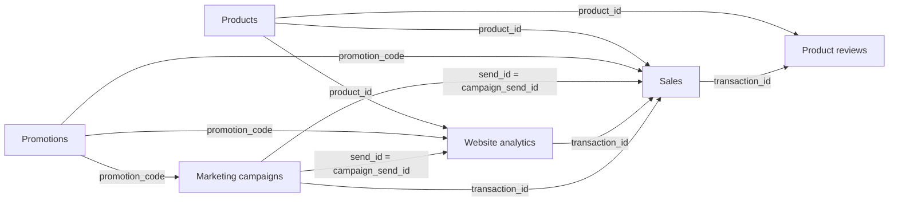

!!! abstract "Indigo"

    For this course, we'll assume that we work for the marketing department of Indigo, a company selling organic cleaning products. Indigo wants to launch a new refillable shampoo product.

We want to answer questions such as:

- Who might be interested in the product in the current customer base?
- Which message and channel should we use?
- How should we price that product?
- What are customers saying about the product?
- What does that teach us about launching a new product?

## Data for this course

### Schema

### Datasets

=== "Sales"

    **One row represents a completed transaction**. `transaction_id` is its unique ID. `gross_total` is the list-price total before discounts; `transaction_total` is after discounts and before refunds; `net_total` is after refunds. `discount_amount`, `refund_amount`, `returned_quantity`, `return_status`, and `return_date` describe discounts and returns. `sales_channel` identifies other sales, website sales, or campaign-attributed sales. `campaign_send_id` and `visit_id` connect attributed sales to their originating events.

    <csv-table src="../data/sales.csv" caption="Sales transactions" page-size="6"></csv-table>

=== "Website analytics"

    **One row represents a product-page visit**. It includes 10,000 ordinary visits and sessions created from campaign clicks. `time_spent` is the session duration in seconds. `product_available` records whether the item was in stock at the start of the visit. A completed purchase has a `transaction_id` that joins to Sales. Campaign sessions also carry `campaign_send_id`, which joins to Marketing campaigns.

    <csv-table src="../data/website_analytics.csv" caption="Website analytics" page-size="6"></csv-table>

=== "Product reviews"

    **One row represents a review of a purchased product**. `transaction_id` joins the review to the sale, and the customer and product IDs match that transaction. The review date is on or after the purchase date. Text varies in length, tone, spelling, casing, and punctuation, including very positive and very negative opinions.

    <csv-table src="../data/product_reviews.csv" caption="Product reviews" page-size="6"></csv-table>

=== "Marketing campaigns"

    **One row represents a campaign message sent to a customer**. Each `experiment_id` is an A/B message test within one campaign. Recipients are randomly assigned to `message_variant` A or B, with the assignment kept consistent for that customer in that campaign; both variants share the campaign's channel, offer, and period. Variant B has a small simulated lift in clicks and purchases. Compare click and purchase rates by experiment and variant. `promotion_code` joins to Promotions. A click has a `visit_id` linking to Website analytics, and its `time_spent` value in seconds matches that session. When `purchased` is true, `transaction_id` joins to Sales and `amount_purchased` equals that transaction's discounted total before refunds.

    <csv-table src="../data/marketing_campaigns.csv" caption="Marketing campaigns" page-size="6"></csv-table>

=== "Products"

    **One row represents a product**. `product_id` joins to sales, website visits, and reviews. `list_price` is in euros and is the price before promotions. `opening_stock` is available at the start of 2025; `monthly_restock_quantity` is added at the start of each following month. Sales cannot exceed available stock, and website visits record whether the product was available.

    <csv-table src="../data/products.csv" caption="Product catalog and stock schedule" page-size="6"></csv-table>

=== "Promotions"

    **One row represents a promotion code**. `discount_rate` is the fraction taken off the product's list price, and the active dates show when the code can be used. Campaign-specific offers also include a `campaign_id`. Promotion codes join to Marketing campaigns, Website analytics, and Sales.

    <csv-table src="../data/promotions.csv" caption="Promotion codes and discounts" page-size="6"></csv-table>

## Pair activity

Choose one of the case questions and work with a partner.

1. Write the decision the team wants to make.
2. List three pieces of data that could help.
3. For each piece, write where it could come from.
4. Add one reason the data might be incomplete, misleading, or inappropriate.

!!! tip "Do not confuse a proxy with the thing itself"

    A click is a record of clicking, not proof that someone read, liked, remembered, or believed a message. A purchase is evidence of a transaction, not a complete explanation of motivation nor a happy customer.
