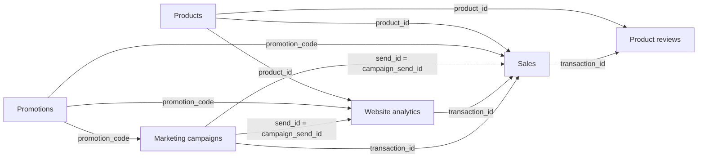

!!! abstract "Indigo"

    For this course, we'll assume that we work for the marketing department of Indigo, a company selling organic cleaning products. Indigo wants to launch a new refillable shampoo product.

We want to answer questions such as:

- Who might be interested in the product in the current customer base?
- Which message and channel should we use?
- How should we brand that product?
- How should we price that product?
- What are customers saying about the product?
- Did the launch increase sales?
- What does that teach us about launching a new product?

## Data for this course

### Schema

### Datasets

=== "Sales"

    **One row represents a completed transaction**. `transaction_id` is its unique ID. `gross_total` is the list-price total before discounts; `transaction_total` is after discounts and before refunds; `net_total` is after refunds. `discount_amount`, `refund_amount`, `returned_quantity`, `return_status`, and `return_date` describe discounts and returns. `sales_channel` identifies other sales, website sales, or campaign-attributed sales. `campaign_send_id` and `visit_id` connect attributed sales to their originating events.

    <csv-table src="../data/sales.csv" caption="Sales transactions" page-size="6"></csv-table>

=== "Website analytics"

    **One row represents a product-page visit**. It includes 10,000 ordinary visits and sessions created from campaign clicks. `time_spent` is the session duration in seconds. `product_available` records whether the item was in stock at the start of the visit. A completed purchase has a `transaction_id` that joins to Sales. Campaign sessions also carry `campaign_send_id`, which joins to Marketing campaigns.

    <csv-table src="../data/website_analytics.csv" caption="Website analytics" page-size="6"></csv-table>

=== "Product reviews"

    **One row represents a review of a purchased product**. `transaction_id` joins the review to the sale, and the customer and product IDs match that transaction. The review date is on or after the purchase date. Text varies in length, tone, spelling, casing, and punctuation, including very positive and very negative opinions.

    <csv-table src="../data/product_reviews.csv" caption="Product reviews" page-size="6"></csv-table>

=== "Marketing campaigns"

    **One row represents a campaign message sent to a customer**. `campaign_id` identifies the campaign; `promotion_code` joins to Promotions. A click has a `visit_id` linking to Website analytics, and its `time_spent` value in seconds matches that session. When `purchased` is true, `transaction_id` joins to Sales and `amount_purchased` equals that transaction's discounted total before refunds.

    <csv-table src="../data/marketing_campaigns.csv" caption="Marketing campaigns" page-size="6"></csv-table>

=== "Products"

    **One row represents a product**. `product_id` joins to sales, website visits, and reviews. `list_price` is in euros and is the price before promotions. `opening_stock` is available at the start of 2025; `monthly_restock_quantity` is added at the start of each following month. Sales cannot exceed available stock, and website visits record whether the product was available.

    <csv-table src="../data/products.csv" caption="Product catalog and stock schedule" page-size="6"></csv-table>

=== "Promotions"

    **One row represents a promotion code**. `discount_rate` is the fraction taken off the product's list price, and the active dates show when the code can be used. Campaign-specific offers also include a `campaign_id`. Promotion codes join to Marketing campaigns, Website analytics, and Sales.

    <csv-table src="../data/promotions.csv" caption="Promotion codes and discounts" page-size="6"></csv-table>

 
 
 
 
 
 
 
 
 
 
 

### Pair activity: what data would Indigo need?

Choose one of the case questions and work with a partner.

1. Write the decision the team wants to make.
2. List three pieces of data that could help.
3. For each piece, write where it could come from.
4. Add one reason the data might be incomplete, misleading, or inappropriate.

!!! tip "Do not confuse a proxy with the thing itself"

    A click is a record of clicking, not proof that someone read, liked, remembered, or believed a message. A purchase is evidence of a transaction, not a complete explanation of motivation.

## 5. The people behind data and AI

Data work is collaborative. Job titles vary between organisations, and one person may perform several roles in a small company.

| Role                              | Main responsibility                                                                      | Example question from Indigo                                        |
| --------------------------------- | ---------------------------------------------------------------------------------------- | ------------------------------------------------------------------- |
| **Chief Data Officer (CDO)**      | Connects data strategy, governance, and business priorities                              | Are we building responsible data capabilities?                      |
| **Data engineer**                 | Builds and maintains systems that collect, move, and store data                          | Can campaign, order, and website data arrive reliably in one place? |
| **Data analyst**                  | Explores and summarises data to answer business questions                                | Which channel had the strongest conversion rate last month?         |
| **Statistician**                  | Designs measurement, samples, experiments, and uncertainty analysis                      | Is the apparent campaign effect larger than normal variation?       |
| **Data scientist**                | Uses statistics, machine learning, and programming to model patterns or make predictions | Which customers are likely to respond to an offer?                  |
| **Data translator**               | Connects business needs, data work, and communication across teams                       | What does "successful launch" mean, and how will we measure it?     |
| **Data Protection Officer (DPO)** | Advises on privacy, data protection obligations, rights, and governance                  | Are we allowed to use this personal data for this purpose?          |

The DPO is not the person who "makes data safe" alone. Everyone who collects, analyses, shares, or acts on data has a responsibility to handle it appropriately.

### Activity: who should be involved?

For each request, identify the first role you would involve and at least one other role they might need.

1. "Our dashboard shows a 40% improvement. Can we publish it?"
2. "The customer data from two systems uses different country codes."
3. "Can we use browsing behaviour to target people with a new offer?"
4. "We want to predict which customers will stop buying."

The marketing manager remains responsible for the business decision. Data specialists help make the evidence more reliable; they do not replace accountability.

### Activity: the AI question checklist

Choose one of the techniques above and answer these questions:

1. What is the decision that the system will support?
2. What is the input data?
3. What would the output be: a number, category, ranking, text, or image?
4. What would count as a useful and fair result?
5. Who could be missing, misclassified, or harmed?
6. What should a person check before acting on the output?

If you cannot answer the first two questions, the problem is probably not ready for AI. Start by clarifying the decision and the data.

!!! warning "Human judgement remains part of the system"

    A model can be technically accurate and still be a poor business choice if the target is wrong, the data is unfair, the output is not actionable, or the use violates people's expectations or rights.

## Exit ticket

Answer these questions in your own words:

1. What is the difference between big data and smart data?
2. Why is open data not automatically suitable for a marketing decision?
3. Give one example of structured data and one example of unstructured data.
4. Which role would you involve for a privacy question? Which role would you involve for a data pipeline problem?
5. For customer-review analysis, which AI technique could help, and what is one limitation?
